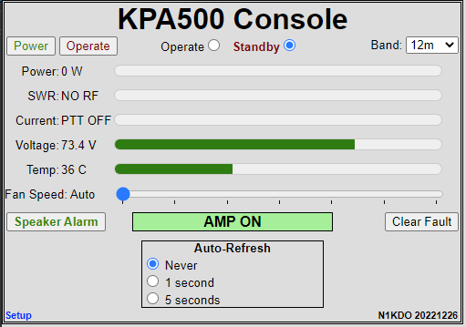

# Raspberry Pi Pico W IOT Thing for Elecraft KPA500 Amplifier

I wanted to Internet-enable my KPA500 amplifier.

I re-used the same electronic design that I used for the [Ham-IV Rotator 
Controller-Controller](https://github.com/n1kdo/rotator-controller-controller).
This is now the _fourth_ project I have made with that hardware.  
I also re-used the web server code from that project here.

The hardware is a Raspberry Pi "Pico W" with a MAX3232 RS-232 interface IC.
Pretty simple.  As usual, the simplicity of the hardware is made up for by
the complexity of the software.

This has a Web Client, accessible from most (all?) browsers, and it also
provides a server compatible with the KPA-500 Remote software from Elecraft.

## Web Client

The KPA500-remote IOT thing provides a web client for the amplifier.

The web client is modeled on the Elecraft KPA500-Remote windows client,
more or less.  The fundamental difference is that the web client will
not automatically update unless one of the non-zero auto-refresh buttons
is selected.  Note that the on every activity, the auto-refresh is 
engaged for three one-second updates regardless of the update settings.
This is to allow the changes made from the UI to be reflected on the page.

## Elecraft "KPA-500 Remote" server

The KPA500-remote IOT thing also provides a network server that is 
compatible with the KPA-500 remote client.

This means that you don't need a dedicated computer to serve the amplifier
to the network, the KPA500-remote IOT thing (this application) does that
already.

n1kdo 20221231