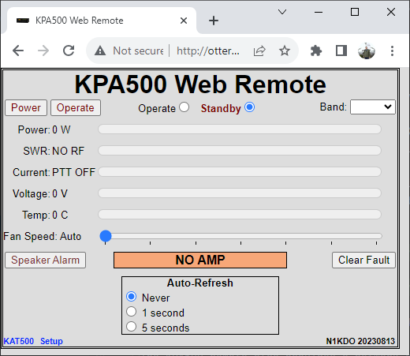
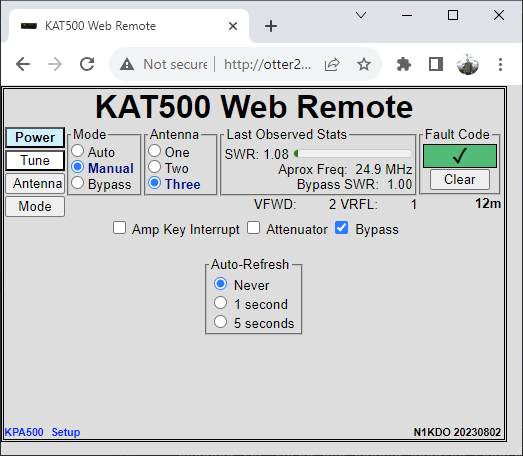

# Raspberry Pi Pico W Web Remote for Elecraft KPA500 Amplifier and KAT500 autotuner

I wanted to Internet-enable my KPA500 amplifier and KAT500 auto-tuner.  This project
provides a Web Client for both the KPA500 and KAT500.  In addition, it also works
as a server for the KPA-500 Remote and KAT-500 Remote software from Elecraft.

This runs on the [Pico-W-Dual-Serial](https://github.com/n1kdo/pico-w-dual-serial) board.

This project uses a lot of the same code as my [Antenna Rotator Controller Controller](https://github.com/n1kdo/rotator-controller-controller)

The hardware is a Raspberry Pi "Pico W" with a MAX3232 RS-232 interface IC.
Pretty simple.  As usual, the simplicity of the hardware is made up for by
the complexity of the software.

## Web Client

The KPA500-remote provides a web client for the amplifier and the auto-tuner.

The web client is modeled on the Elecraft KPA500-Remote windows client,
more or less.  The fundamental difference is that the web client will
not automatically update unless one of the non-zero auto-refresh buttons
is selected.  Note that the on every activity, the auto-refresh is 
engaged for three one-second updates regardless of the update settings.
This is to allow the changes made from the UI to be reflected on the page.

## Elecraft "KPA-500 Remote" server and "KAT-500 Remote" server

The KPA500-remote also provides a network server that is 
compatible with the KPA-500 remote client, and a network server
that is compatible with the KAT-500 remote client.

This means that you don't need a dedicated computer to serve the amplifier
and tuner to the network, the KPA500-remote (this application) does that for you.

No need to run a PC at your remote station!

See [Installation and Setup](Installation-and-Setup.md) for (duh) Installation and Setup
instructions.
